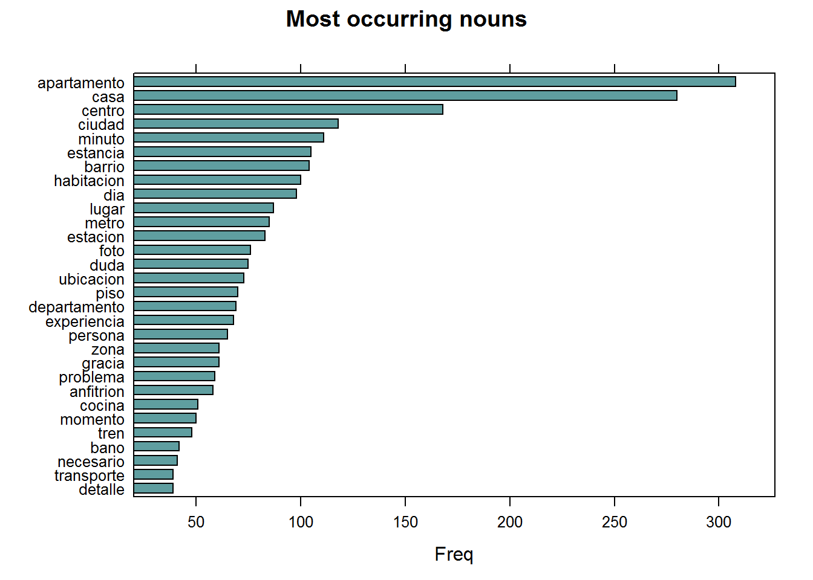
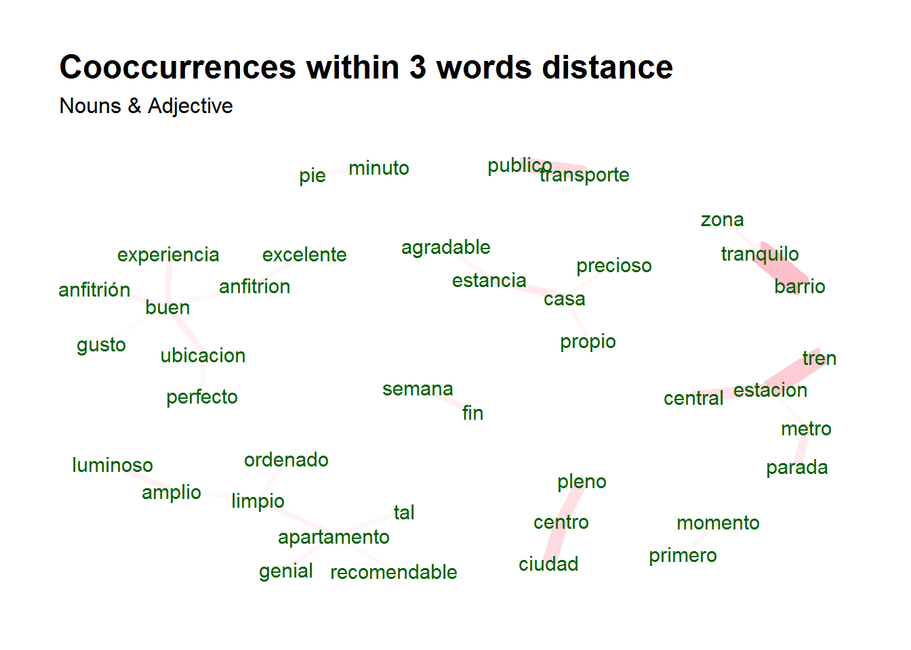
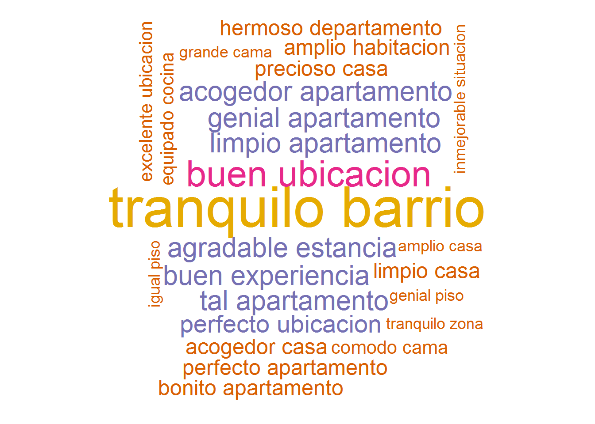

## An overview of keyword extraction techniques 

In this post, we will show 6 keyword extraction techniques which allow to **find keywords in plain text**. Keywords are frequently occuring words which occur somehow together in plain text. Common examples are New York, Monte Carlo, Mixed Models, Brussels Hoofdstedelijk Gewest, Public Transport, Central Station, p-values, ...

If you master these techniques, it will allow you to easily step away from doing simple word frequency statistics to more business-relevant text summarisation. For this, we will use the udpipe R package (docs at https://CRAN.R-project.org/package=udpipe or https://bnosac.github.io/udpipe/en) which is the core R package you need for doing this type of t ext processing.We'll basically show how to easily extract keywords as follows:

1. Find keywords by doing **Parts of Speech tagging in order to identify nouns**
2. Find keywords based on **Collocations and Co-occurrences**
3. Find keywords based on the **Textrank** algorithm
4. Find keywords based on **RAKE (rapid automatic keyword extraction)**
5. Find keywords by looking for **Phrases** (noun phrases / verb phrases)
6. Find keywords based on **results of dependency parsing** (getting the subject of the text)

These techniques will allow you to move away from showing silly word graphs to more relevant graphs containing keywords.


### Example

As an example we are going to use feedback in Spanish of customers going to an AirBnB appartment in Brussels. This data is part of the udpipe R package. We extract the **Spanish** text and annotate it using the udpipe R package. Annotation performs **tokenisation, parts of speech tagging, lemmatisation and dependency parsing**.


```r
library(udpipe)
library(textrank)

## First step: Take the Spanish udpipe model and annotate the text. Note: this takes about 3 minutes
data(brussels_reviews)
comments <- subset(brussels_reviews, language %in% "es")

ud_model <- udpipe_download_model(language = "spanish")
ud_model <- udpipe_load_model(ud_model$file_model)
x <- udpipe_annotate(ud_model, x = comments$feedback, trace = TRUE)
x <- as.data.frame(x)
```


Once we have the annotation, finding keywords is a breeze. Let's show how this can be easily accomplished.

### Option 1: Extracting only nouns

An easy way in order to find keywords is by looking at **nouns**. As each term has a Parts of Speech tag if you annotated text using the udpipe package, you can easily do this as follows.


```r
stats <- subset(x, upos %in% "NOUN")
stats <- txt_freq(x = stats$lemma)

library(lattice)
stats$key <- factor(stats$key, levels = rev(stats$key))
barchart(key ~ freq, data = head(stats, 30), col = "cadetblue", main = "Most occurring nouns", xlab = "Freq")
```



### Option 2: Collocation & co-occurrences

Although nouns are a great start, you are probably interested in multi-word expressions. You can get multi-word expression by looking either at **collocations** (words following one another), at **word co-occurrences within each sentence** or at word co-occurrences of **words which are close in the neighbourhood of one another**. These approaches can be executed as follows using the udpipe R package. If we combine this with selecting **only the nouns and adjectives**, this becomes already nice.


```r
## Collocation (words following one another)
stats <- keywords_collocation(x = x, 
                             term = "token", group = c("doc_id", "paragraph_id", "sentence_id"),
                             ngram_max = 4)
## Co-occurrences: How frequent do words occur in the same sentence, in this case only nouns or adjectives
stats <- cooccurrence(x = subset(x, upos %in% c("NOUN", "ADJ")), 
                     term = "lemma", group = c("doc_id", "paragraph_id", "sentence_id"))
## Co-occurrences: How frequent do words follow one another
stats <- cooccurrence(x = x$lemma, 
                     relevant = x$upos %in% c("NOUN", "ADJ"))
## Co-occurrences: How frequent do words follow one another even if we would skip 2 words in between
stats <- cooccurrence(x = x$lemma, 
                     relevant = x$upos %in% c("NOUN", "ADJ"), skipgram = 2)
head(stats)
```

```
##        term1     term2 cooc
## 1     barrio tranquilo   36
## 2   estacion      tren   30
## 3 transporte   publico   23
## 4     centro    ciudad   23
## 5      pleno    centro   20
## 6   estacion   central   19
```

Visualisation of these co-occurrences can be done using a network plot as follows for the top 30 most frequent co-occurring nouns and adjectives.


```r
library(igraph)
library(ggraph)
library(ggplot2)
wordnetwork <- head(stats, 30)
wordnetwork <- graph_from_data_frame(wordnetwork)
ggraph(wordnetwork, layout = "fr") +
  geom_edge_link(aes(width = cooc, edge_alpha = cooc), edge_colour = "pink") +
  geom_node_text(aes(label = name), col = "darkgreen", size = 4) +
  theme_graph(base_family = "Arial Narrow") +
  theme(legend.position = "none") +
  labs(title = "Cooccurrences within 3 words distance", subtitle = "Nouns & Adjective")
```



### Option 3: Textrank (word network ordered by Google Pagerank)

Another approach for keyword detection is **Textrank**. Textrank is an algorithm implemented in the textrank R package. The algorithm allows to summarise text and as well allows to extract keywords. This is done by constructing a **word network** by looking if words are following one another. On top of that network the 'Google Pagerank' algorithm is applied to extract relevant words after which relevant words which are following one another are combined to get keywords. In the below example, we are interested in finding keywords using that algorithm of either nouns or adjectives following one another. You can see from the plot below that the keywords combines words together into multi-word expressions.


```r
stats <- textrank_keywords(x$lemma, 
                          relevant = x$upos %in% c("NOUN", "ADJ"), 
                          ngram_max = 8, sep = " ")
stats <- subset(stats$keywords, ngram > 1 & freq >= 5)
library(wordcloud)
wordcloud(words = stats$keyword, freq = stats$freq)
```


### Option 4: Rapid Automatic Keyword Extraction: RAKE

Next basic algorithm is called RAKE which is an acronym for **Rapid Automatic Keyword Extraction**. It looks for keywords by looking to a contiguous sequence of words which do not contain irrelevant words. Namely by

- calculating a score for each word which is part of any candidate keyword, this is done by
    - among the words of the candidate keywords, the algorithm looks how many times each word is occurring and how many times it co-occurs with other words
    - **each word gets a score which is the ratio of the word degree (how many times it co-occurs with other words) to the word frequency**
- a RAKE score for the full candidate keyword is calculated by summing up the scores of each of the words which define the candidate keyword


```r
stats <- keywords_rake(x = x, 
                      term = "token", group = c("doc_id", "paragraph_id", "sentence_id"),
                      relevant = x$upos %in% c("NOUN", "ADJ"),
                      ngram_max = 4)
head(subset(stats, freq > 3))
```

```
##                  keyword ngram freq     rake
## 6  perfectas condiciones     2    4 2.000000
## 8             unica pega     2    7 2.000000
## 12           grand place     2    6 1.900000
## 13   grandes anfitriones     2    4 1.809717
## 18    transporte publico     2   21 1.685714
## 21    buenos anfitriones     2    9 1.662281
```


### Option 5: Phrases

Next option is to extract phrases. These are defined as a **sequence of Parts of Speech Tags**. Common type of phrases are noun phrases or verb phrases. How does this work? Parts of Speech tags are recoded to one of the following one-letters: (A: adjective, C: coordinating conjuction, D: determiner, M: modifier of verb, N: noun or proper noun, P: preposition). Next you can define a regular expression to indicate a sequence of parts of speech tags which you want to extract from the text.


```r
## Simple noun phrases (a adjective+noun, pre/postposition, optional determiner and another adjective+noun)
x$phrase_tag <- as_phrasemachine(x$upos, type = "upos")
stats <- keywords_phrases(x = x$phrase_tag, term = x$token, 
                         pattern = "(A|N)+N(P+D*(A|N)*N)*", 
                         is_regex = TRUE, ngram_max = 4, detailed = FALSE)
head(subset(stats, ngram > 2))
```

```
##                           keyword ngram freq
## 10                   Gare du Midi     3   12
## 34       pleno centro de Bruselas     4    6
## 68               15 minutos a pie     4    4
## 70               nos explico todo     3    4
## 75 primera experiencia con Airbnb     4    3
## 78                   Gare du Nord     3    3
```

### Option 6: Use dependency parsing output to get the nominal subject and the adjective of it

In the last option, we will show how to use the results of the **dependency parsing**. When you executed the annotation using udpipe, the dep_rel field indicates how words are related to one another. A token is related to the parent using token_id and head_token_id. The dep_rel field indicates how words are linked to one another. The type of relations are defined at http://universaldependencies.org/u/dep/index.html. For this exercise we are going to take the words which have as dependency relation nsubj indicating the **nominal subject** and we are adding to that the adjective which is changing the nominal subject.

In this way we can combine what are people talking about with the adjective they use when they talk about the subject.


```r
stats <- merge(x, x, 
           by.x = c("doc_id", "paragraph_id", "sentence_id", "head_token_id"),
           by.y = c("doc_id", "paragraph_id", "sentence_id", "token_id"),
           all.x = TRUE, all.y = FALSE, 
           suffixes = c("", "_parent"), sort = FALSE)
stats <- subset(stats, dep_rel %in% "nsubj" & upos %in% c("NOUN") & upos_parent %in% c("ADJ"))
stats$term <- paste(stats$lemma_parent, stats$lemma, sep = " ")
stats <- txt_freq(stats$term)
library(wordcloud)
wordcloud(words = stats$key, freq = stats$freq, min.freq = 3, max.words = 100,
          random.order = FALSE, colors = c("#1B9E77", "#D95F02", "#7570B3", "#E7298A", "#66A61E", "#E6AB02"))
```



Now up to you. Can you do the same on your own text?

**Credits**: This analysis would not have been possible without the Spanish annotated treebanks (https://github.com/UniversalDependencies/UD_Spanish-GSD in particular as made available through http://universaldependencies.org) and the UDPipe C++ library and models provided by Milan Straka (https://github.com/ufal/udpipe). All credits have to go there. 
