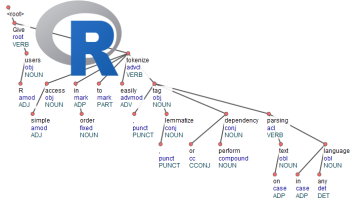

```{r setup, include=FALSE, cache=FALSE}
options(width = 1000)
knitr::opts_chunk$set(echo = TRUE, message = FALSE, comment = NA, eval = TRUE)
```

## UDPipe - General

The data preparation part of any Natural Language Processing flow consists of a number of important steps: Tokenization (1), Parts of Speech tagging (2), Lemmatization (3) and Dependency Parsing (4). This package allows you to do out-of-the-box annotation of these 4 steps and also allows you to train your own annotator models directly from R.



It does this by providing an Rcpp wrapper around the UDPipe C++ library which is described at http://ufal.mff.cuni.cz/udpipe and is available at https://github.com/ufal/udpipe.

### udpipe the R package

The udpipe R package was designed with the following things in mind when building the Rcpp wrapper around the UDPipe C++ library:

- Give R users simple access in order to easily tokenize, tag, lemmatize or perform dependency parsing on text in any language
- Provide easy access to pre-trained annotation models
- Allow R users to easily construct your own annotation model based on data in CONLL-U format as provided in more than 60 treebanks available at http://universaldependencies.org/#ud-treebanks
- Don't rely on Python or Java so that R users can easily install this package without configuration hassle
- No external R package dependencies except the strict necessary (Rcpp and data.table, no tidyverse)

### UDPipe the C++ library

- UDPipe provides language-agnostic tokenization, tagging, lemmatization and dependency parsing of raw text, which is an essential part in natural language processing.
- UDPipe allows to work with data in CONLL-U format as described at http://universaldependencies.org/format.html
- The techniques used are explained in detail in the paper: "Tokenizing, POS Tagging, Lemmatizing and Parsing UD 2.0 with UDPipe", available at <http://ufal.mff.cuni.cz/~straka/papers/2017-conll_udpipe.pdf>. In that paper, you'll also find accuracies on different languages and process flow speed (measured in words per second).

## udpipe models

### Pre-trained models

Before you can start on performing the annotation, you need a model. Pre-trained Universal Dependencies 2.0 models on all UD treebanks are made available for more than 50 languages trained on 69 treebanks, namely: 

**afrikaans, ancient_greek-proiel, ancient_greek, arabic, basque, belarusian, bulgarian, catalan, chinese, coptic, croatian, czech-cac, czech-cltt, czech, danish, dutch-lassysmall, dutch, english-lines, english-partut, english, estonian, finnish-ftb, finnish, french-partut, french-sequoia, french, galician-treegal, galician, german, gothic, greek, hebrew, hindi, hungarian, indonesian, irish, italian, japanese, kazakh, korean, latin-ittb, latin-proiel, latin, latvian, lithuanian, norwegian-bokmaal, norwegian-nynorsk, old_church_slavonic, persian, polish, portuguese-br, portuguese, romanian, russian-syntagrus, russian, sanskrit, serbian, slovak, slovenian-sst, slovenian, spanish-ancora, spanish, swedish-lines, swedish, tamil, turkish, ukrainian, urdu, uyghur, vietnamese**.

For R users who want to use these open-sourced models provided by the UDPipe community and start on tagging, you can proceed as follows to download the model of the language of your choice. 

```{r}
library(udpipe)
dl <- udpipe_download_model(language = "dutch")
str(dl)
```


### Build your own annotator models

The udipe R package also allows you to easily train your own models, based on data in CONLL-U format, so that you can use these for your own commercial or non-commercial purposes. This is described in the other vignette of this package which you can view by the command `vignette("udpipe-train", package = "udpipe")`
`


## Annotate text

Currently the package allows you to do tokenisation, tagging, lemmatization and dependency parsing with one convenient function called `udpipe_annotate`. This goes as follows. 

### Load the model

First load the model which you have downloaded or which you have stored somewhere on disk. 

```{r}
## Either give a file in the current working directory
udmodel_dutch <- udpipe_load_model(file = "dutch-ud-2.0-170801.udpipe")
## Or give the full path to the file 
udmodel_dutch <- udpipe_load_model(file = dl$file_model)
```

### Annotate your text

#### Tokenisation, tagging and parsing

Once you have this model, you can start on annotating. Provide a vector of text and use `udpipe_annotate`. The resulting tagged output is in CONLL-U format as described at http://universaldependencies.org/format.html. You can put this in a data.frame format with `as.data.frame`.

```{r}
txt <- c("Ik ben de weg kwijt, kunt u me zeggen waar de Lange Wapper ligt? Jazeker meneer", 
         "Het gaat vooruit, het gaat verbazend goed vooruit")
x <- udpipe_annotate(udmodel_dutch, x = txt)
x <- as.data.frame(x)
str(x)
table(x$upos)
```

#### Only part of the annotation

Mark that by default `udpipe_annotate` does Tokenization, Parts of Speech Tagging, Lemmatization and Dependency parsing. If you want to gain some time because you require only a part of the annotation, you can specify to leave parts of the annotation out. This is done as follows.

```{r, results='hide'}
## Tokenization + finds sentences, does not execute POS tagging, nor lemmatization or dependency parsing
x <- udpipe_annotate(udmodel_dutch, x = txt, tagger = "none", parser = "none")
x <- as.data.frame(x)
table(x$upos)
table(x$dep_rel)

## Tokenization + finds sentences, does POS tagging and lemmatization but does not execute dependency parsing
x <- udpipe_annotate(udmodel_dutch, x = txt, tagger = "default", parser = "none")
x <- as.data.frame(x)
table(x$upos)
table(x$dep_rel)

## Tokenization + finds sentences and executes dependency parsing but does not do POS tagging nor lemmatization
x <- udpipe_annotate(udmodel_dutch, x = txt, tagger = "none", parser = "default")
x <- as.data.frame(x)
table(x$upos)
table(x$dep_rel)
```

### Remarks

Some remarks:

- If your model is not trained to be able to do parsing/tagging, you can not request it to do parsing/tagging
- Use argument `doc_id` to  `udpipe_annotate` so that you can link your document to the tagged terms later on
- Your text has to be in UTF-8 Encoding when you pass it to `udpipe_annotate`, if you don't have that Encoding use standard R facilities like `iconv` to convert it to UTF-8. You get also results in UTF-8 encoding back.

```{r}
dl <- udpipe_download_model(language = "sanskrit")
udmodel_sanskrit <- udpipe_load_model(file = dl$file_model)
txt <- "ततः असौ प्राह क्षत्रियस्य तिस्रः भार्या धर्मम् भवन्ति तत् एषा कदाचिद् वैश्या सुता भविष्यति तत् अनुरागः ममास्याम् ततः रथकारः तस्य निश्चयम् विज्ञायावदत् वयस्य किम् अ धुना कर्तव्यम् कौलिकः आह किम् अहम् जानामि त्वयि मित्रे यत् अभिहितं मया ततः"
x <- udpipe_annotate(udmodel_sanskrit, x = txt)
Encoding(x$conllu)
x <- as.data.frame(x)
```

- If you want to work with other tools which are capable of handling CONLL-U format, just export your annotation to a file as shown below

```{r}
x <- udpipe_annotate(udmodel_sanskrit, x = txt)
cat(x$conllu, file = "myannotation.conllu")
```

## Support in text mining

Need support in text mining. 
Contact BNOSAC: http://www.bnosac.be


```{r, results='hide', echo=FALSE}
invisible(file.remove(c("dutch-ud-2.0-170801.udpipe", 
                        "sanskrit-ud-2.0-170801.udpipe",
                        "myannotation.conllu")))
```
