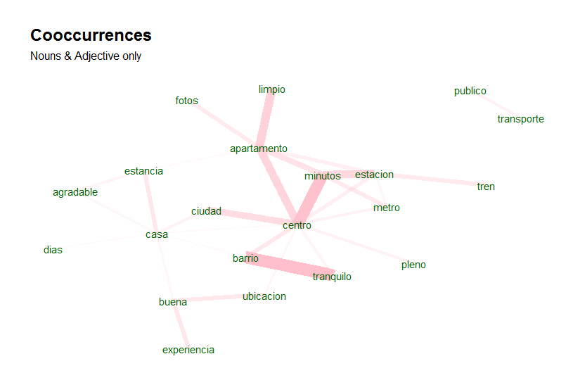
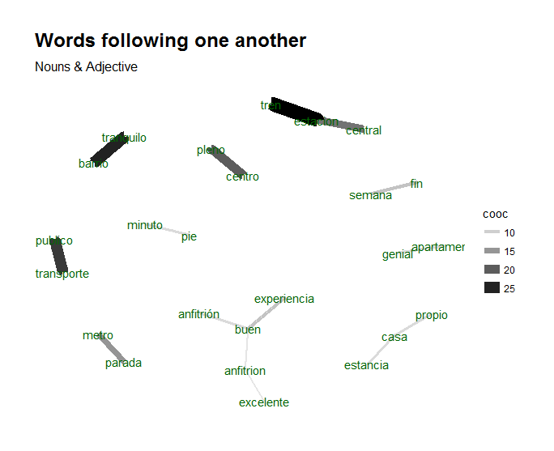

```{r setup, include=FALSE, cache=FALSE}
options(width = 1000)
knitr::opts_chunk$set(echo = TRUE, message = FALSE, warning = FALSE, comment = NA, eval = TRUE, fig.width = 5, fig.height = 5)
```

## UDPipe - Basic Analytics

In order to get the most out of the package, let's enumerate a few things one can now easily do with your text annotated using the udpipe package using merely the Parts of Speech tags & the Lemma of each word. 

- Improved exploratory text visualisations 
    - Due to richer features
    - Allowing to select easily words which you like to plot (e.g. nouns/adjectives or the subject of the text)
    - look for co-occurrences between words which are relevant based on the POS tag
    - look for correlations between words which are relevant based on the POS tag
- Easy summarisation of text
    - automatic keyword detection
    - noun phrase extraction or chunking
    - automatic text summarisation (e.g. using the textrank R package)
- Improved topic modelling by 
    - taking only words with specific parts-of-speech tags in the topic model
    - automation of topic modelling for all languages by using the right pos tags instead of working with stopwords
    - using lemmatisation as a better replacement than stemming in topic modelling
- Further processing
    - Improved sentence or document similarities by using only the words of a specific POS tag
    - Identification of authors based on grammatical patterns used

In particular, in this report we focus on basic analytical use cases of pos tagging, lemmatisation and co-occurrences where we will show in this vignette some basic frequency statistics which can be extracted without any hassle once you have annotated your text. 
**Furthermore, the logic accounts for all languages and is language-agnostic.**

### Start with annotating

Let's start by annotating some text in Spanish. The annotated data.frame can next be used for basic text analytics. 

```{r}
library(udpipe)
ud_model <- udpipe_download_model(language = "spanish")
```

```{r, echo=FALSE}
knitr::opts_chunk$set(echo = TRUE, message = FALSE, warning = FALSE, comment = NA, eval = !ud_model$download_failed)
```

```{r}
data(brussels_reviews)
comments <- subset(brussels_reviews, language %in% "es")

ud_model <- udpipe_load_model(ud_model$file_model)
x <- udpipe_annotate(ud_model, x = comments$feedback, doc_id = comments$id)
x <- as.data.frame(x)
```

The resulting data.frame has a field called `upos` which is the Universal Parts of Speech tag and also a field called `lemma` which is the root form of each token in the text. These 2 fields give us a broad range of analytical possibilities. 

## Basic frequency statistics

In most languages, nouns (NOUN) are the most common types of words, next to verbs (VERB) and these are the most relevant for analytical purposes, next to the adjectives (ADJ) and proper nouns (PROPN). For a detailed list of all POS tags: visit https://universaldependencies.org/u/pos/index.html.

```{r}
library(lattice)
stats <- txt_freq(x$upos)
stats$key <- factor(stats$key, levels = rev(stats$key))
barchart(key ~ freq, data = stats, col = "cadetblue", 
         main = "UPOS (Universal Parts of Speech)\n frequency of occurrence", 
         xlab = "Freq")
```

Parts of Speech tags are really interesting to extract easily the words you like to plot. You really don't need stopwords for doing this, just select nouns / verbs or adjectives and you have already the most relevant parts for basic frequency analysis.

```{r}
## NOUNS
stats <- subset(x, upos %in% c("NOUN")) 
stats <- txt_freq(stats$token)
stats$key <- factor(stats$key, levels = rev(stats$key))
barchart(key ~ freq, data = head(stats, 20), col = "cadetblue", 
         main = "Most occurring nouns", xlab = "Freq")
## ADJECTIVES
stats <- subset(x, upos %in% c("ADJ")) 
stats <- txt_freq(stats$token)
stats$key <- factor(stats$key, levels = rev(stats$key))
barchart(key ~ freq, data = head(stats, 20), col = "cadetblue", 
         main = "Most occurring adjectives", xlab = "Freq")
```

## Finding keywords

Frequency statistics of words are nice but most of the time, you are getting stuck in words which only make sense in combination with other words. Hence you want to find keywords which are a combination of words.

Currently, this R package provides 3 methods to identify keywords in text

- RAKE (Rapid Automatic Keyword Extraction)
- Collocation ordering using Pointwise Mutual Information
- Parts of Speech phrase sequence detection

```{r}
## Using RAKE
stats <- keywords_rake(x = x, term = "lemma", group = "doc_id", 
                       relevant = x$upos %in% c("NOUN", "ADJ"))
stats$key <- factor(stats$keyword, levels = rev(stats$keyword))
barchart(key ~ rake, data = head(subset(stats, freq > 3), 20), col = "cadetblue", 
         main = "Keywords identified by RAKE", 
         xlab = "Rake")

## Using Pointwise Mutual Information Collocations
x$word <- tolower(x$token)
stats <- keywords_collocation(x = x, term = "word", group = "doc_id")
stats$key <- factor(stats$keyword, levels = rev(stats$keyword))
barchart(key ~ pmi, data = head(subset(stats, freq > 3), 20), col = "cadetblue", 
         main = "Keywords identified by PMI Collocation", 
         xlab = "PMI (Pointwise Mutual Information)")

## Using a sequence of POS tags (noun phrases / verb phrases)
x$phrase_tag <- as_phrasemachine(x$upos, type = "upos")
stats <- keywords_phrases(x = x$phrase_tag, term = tolower(x$token), 
                          pattern = "(A|N)*N(P+D*(A|N)*N)*", 
                          is_regex = TRUE, detailed = FALSE)
stats <- subset(stats, ngram > 1 & freq > 3)
stats$key <- factor(stats$keyword, levels = rev(stats$keyword))
barchart(key ~ freq, data = head(stats, 20), col = "cadetblue", 
         main = "Keywords - simple noun phrases", xlab = "Frequency")
```

## Co-occurrences

Co-occurrences allow to see how words are used either in the same sentence or next to each other. This R package make creating co-occurrence graphs using the relevant Parts of Speech tags as easy as possible.

### Nouns / adjectives used in same sentence

In this example we look how many times nouns and adjectives are used in the same sentence.

```{r}
cooc <- cooccurrence(x = subset(x, upos %in% c("NOUN", "ADJ")), 
                     term = "lemma", 
                     group = c("doc_id", "paragraph_id", "sentence_id"))
head(cooc)
```

The result can be easily visualised using the ggraph R package which can visualise the word network. 

```{r eval=FALSE}
library(igraph)
library(ggraph)
library(ggplot2)
wordnetwork <- head(cooc, 30)
wordnetwork <- graph_from_data_frame(wordnetwork)
ggraph(wordnetwork, layout = "fr") +
  geom_edge_link(aes(width = cooc, edge_alpha = cooc), edge_colour = "pink") +
  geom_node_text(aes(label = name), col = "darkgreen", size = 4) +
  theme_graph(base_family = "Arial Narrow") +
  theme(legend.position = "none") +
  labs(title = "Cooccurrences within sentence", subtitle = "Nouns & Adjective")
```



### Nouns / adjectives which follow one another

If you are interested in visualising which words follow one another. This can be done by calculating word cooccurrences of a specific Parts of Speech type which follow one another where you can specify how far away you want to look regarding 'following one another' (in the example below we indicate skipgram = 1 which means look to the next word and the word after that).

```{r}
cooc <- cooccurrence(x$lemma, relevant = x$upos %in% c("NOUN", "ADJ"), skipgram = 1)
head(cooc)
```

Once you have these coocccurrences, you can easily perform the same plotting as above. 

```{r eval=FALSE}
library(igraph)
library(ggraph)
library(ggplot2)
wordnetwork <- head(cooc, 15)
wordnetwork <- graph_from_data_frame(wordnetwork)
ggraph(wordnetwork, layout = "fr") +
  geom_edge_link(aes(width = cooc, edge_alpha = cooc)) +
  geom_node_text(aes(label = name), col = "darkgreen", size = 4) +
  theme_graph(base_family = "Arial Narrow") +
  labs(title = "Words following one another", subtitle = "Nouns & Adjective")
```



For details on the visualisation of networks, visit the igraph and ggraph packages. The network plots shown above are just run once to show basic functionality, they are not run in the vignette in order to reduce package dependencies and to leave the freedom to people to choose their preferred visualisation toolkit.

## Correlations

Keyword correlations indicate how terms are just together in a same document/sentence. While co-occurrences focus on frequency, correlation measures between 2 terms can also be high even if 2 terms occur only a small number of times but always appear together. 

In the below example, we show how nouns and adjectives are correlated within each sentence of a document.

```{r}
x$id <- unique_identifier(x, fields = c("sentence_id", "doc_id"))
dtm <- subset(x, upos %in% c("NOUN", "ADJ"))
dtm <- document_term_frequencies(dtm, document = "id", term = "lemma")
dtm <- document_term_matrix(dtm)
dtm <- dtm_remove_lowfreq(dtm, minfreq = 5)
termcorrelations <- dtm_cor(dtm)
y <- as_cooccurrence(termcorrelations)
y <- subset(y, term1 < term2 & abs(cooc) > 0.2)
y <- y[order(abs(y$cooc), decreasing = TRUE), ]
head(y)
```

## Support in text mining

Need support in text mining. 
Contact BNOSAC: http://www.bnosac.be

```{r, results='hide', echo=FALSE}
invisible(if(file.exists(ud_model$file)) file.remove(c(ud_model$file)))
```